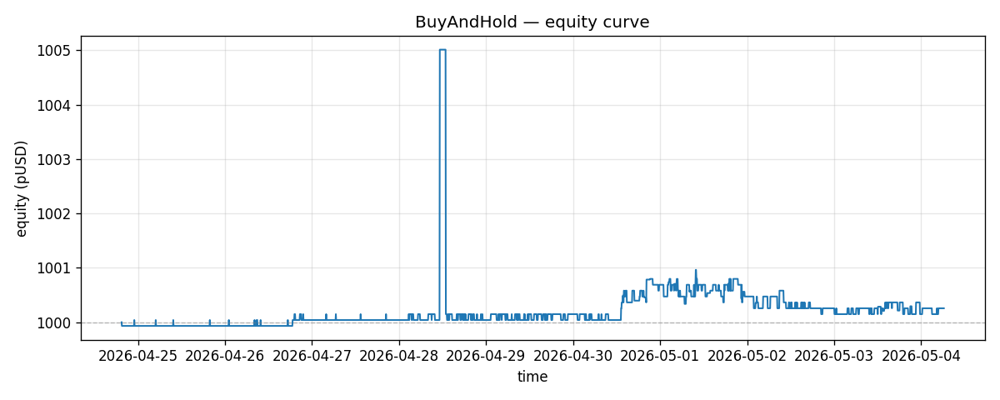
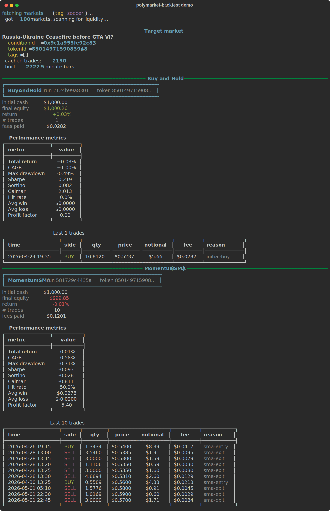

# polymarket-backtest

> Event-driven backtest framework for Polymarket trading strategies. Built for V2 (April 2026 cutover), backwards-compatible with V1 historical data.

[]() []() []() []()



<p align="center"><i>Sample equity curve produced by <code>scripts/generate_demo_assets.py</code> on a live Polymarket market.</i></p>

Polymarket's V2 launched April 22, 2026 — new fee formula, new collateral (pUSD), new order struct. Every strategy that worked on V1 needs re-testing under the new mechanics. This framework lets you do that without writing your own simulator from scratch.

## What it does

- **Pulls historical data** — markets via Gamma API, executed trades via Data API, cached locally in SQLite.
- **Builds OHLC bars** — resamples raw trade prints into 1-min / 5-min / 1-hour candles per CLOB token.
- **Runs event-driven simulations** — strategies receive bars sequentially, return orders, engine executes against the next bar with no lookahead.
- **Models V2 fees correctly** — `fee = C × feeRate × p × (1 − p)`, takers only, makers free. V1 fallback for pre-cutover backtests.
- **Tracks portfolio state** — pUSD cash, positions, realized + unrealized PnL, fees paid.
- **Reports performance** — Sharpe, Sortino, max drawdown, Calmar, hit rate, equity curve.

## Why this exists

Strategies that look great in your head die in the data. Three things kill prediction-market alphas that nobody catches without a backtester:

1. **Fee drag at extreme prices** — V2's `p × (1 − p)` term means fees are highest at p=0.5, but cumulative fees on a high-frequency strategy at p=0.6 still eat 5-15% of edge.
2. **Slippage on thin books** — Polymarket's liquidity is bursty. Trades that look fillable at the mid often cost 50-200 bps to execute.
3. **Resolution drag** — markets that "should have" resolved YES sometimes go through 2-day UMA disputes, locking capital and screwing up your reinvestment cycle.

This framework surfaces all three.

## Installation

```bash
git clone https://github.com/cengizmandros/polymarket-backtest.git
cd polymarket-backtest
python -m venv .venv
source .venv/bin/activate   # Windows: .venv\Scripts\activate
pip install -r requirements.txt
```

No paid API keys required for backtesting public market data. The Polymarket Data API is open.

## Quickstart

```bash
# 1. Fetch some historical data (soccer markets, last 30 days)
python -m src.cli.main fetch --tag soccer --since 2026-04-01

# 2. Run a buy-and-hold backtest
python -m src.cli.main backtest \
    --strategy buy_and_hold \
    --market 0x1234... \
    --initial-cash 1000 \
    --start 2026-04-05 \
    --end 2026-04-30

# 3. View the report
python -m src.cli.main report <run_id>
```

Or use the Python API directly — see `examples/quickstart.py`.

### Sample report output

The CLI prints a Rich terminal report after every backtest:



## Writing a strategy

Subclass `Strategy` and implement `on_bar`:

```python
from src.strategy.base import Strategy, Order, Side

class MyStrategy(Strategy):
    def __init__(self, lookback: int = 20):
        self.lookback = lookback
        self.history = []

    def on_bar(self, bar, portfolio):
        self.history.append(bar.close)
        if len(self.history) < self.lookback:
            return []

        sma = sum(self.history[-self.lookback:]) / self.lookback
        if bar.close < sma * 0.95 and portfolio.position(bar.token_id).qty == 0:
            # Price is 5% below SMA, buy
            return [Order(token_id=bar.token_id, side=Side.BUY, size=100)]
        if bar.close > sma * 1.05 and portfolio.position(bar.token_id).qty > 0:
            # Price is 5% above SMA, sell
            return [Order(token_id=bar.token_id, side=Side.SELL,
                          size=portfolio.position(bar.token_id).qty)]
        return []
```

That's it. The engine handles fees, slippage, mark-to-market, and PnL.

## Architecture

```
polymarket-backtest/
├── src/
│   ├── constants.py            # V2 addresses, default fee rates
│   ├── data/
│   │   ├── store.py            # SQLite schema + CRUD
│   │   └── fetcher.py          # Async Gamma + Data API ingestion
│   ├── sim/
│   │   ├── fees.py             # V2 fee formula, V1 fallback
│   │   ├── portfolio.py        # Positions, cash, PnL accounting
│   │   └── engine.py           # Backtest event loop
│   ├── strategy/
│   │   ├── base.py             # Strategy ABC, Order dataclass
│   │   └── examples/
│   │       ├── buy_and_hold.py
│   │       └── momentum.py
│   ├── analytics/
│   │   ├── metrics.py          # Performance statistics
│   │   └── report.py           # Rich terminal + matplotlib output
│   └── cli/main.py             # CLI entry point
├── examples/
│   └── quickstart.py
├── tests/
└── requirements.txt
```

## V2 fee model

V2 fees are protocol-set per-market and computed at match time:

```
fee = C × feeRate × p × (1 − p)
```

Where:
- `C` = trade notional in USDC units
- `feeRate` = per-market rate from `getClobMarketInfo().fd.rate` (typically 0.02 = 2%)
- `p` = execution price ∈ (0, 1)
- `(1 − p)` makes the fee symmetric — highest at p=0.5, near-zero at the extremes

**Makers pay no fees.** Only takers. The simulator defaults all market orders to taker, limit orders to maker (configurable per order via `Order.role`).

## Slippage model

Polymarket doesn't publish historical orderbooks, so backtests can't replay exact fills. The engine offers three slippage models:

- **`bar_close`** — fills at the bar close price. Optimistic, useful for quick prototyping.
- **`bar_vwap`** — fills at the bar's volume-weighted average. Most realistic for liquid markets.
- **`linear_impact`** — fills at `close × (1 + impact_bps × size / bar_volume)`. Most realistic for thin markets.

Default: `bar_vwap`. Override per-strategy via `engine.run(slippage="linear_impact", impact_bps=20)`.

## Limitations

- **No orderbook replay.** Slippage is approximated from bar VWAP, not actual depth. Strategies that rely on micro-edge (sub-bps) will see optimistic fills.
- **No partial fills modeled.** Orders either fully fill at the simulated price or are skipped if size > bar volume × `max_participation` (default 30%).
- **Resolution events** are mark-to-zero / mark-to-one based on the resolved outcome, with no dispute period modeling. Real-world dispute drag is not simulated.
- **Builder rebates not modeled.** If you're paid for builder attribution, add it manually to your strategy's reported edge.

## Roadmap

- [ ] Walk-forward optimization helper
- [ ] Multi-market portfolio backtests (currently single-market only in v0.1)
- [ ] Live paper-trading mode (run strategy against live data without real orders)
- [ ] Synthetic orderbook replay from snapshots (when Polymarket exposes them)
- [ ] Web dashboard for browsing run history

## Related

Part of the Polymarket developer toolkit:
- [polymarket-arb](https://github.com/cengizmandros/polymarket-arb) — cross-market arb scanner (uses live data, this lib backtests strategies)
- [polymarket-v2-migration-kit](https://github.com/cengizmandros/polymarket-v2-migration-kit) — audit V1 codebases for V2 migration
- [polymarket-v2-example-bot](https://github.com/cengizmandros/polymarket-v2-example-bot) — minimal V2 reference bot
- [polymarket-cheatsheet](https://github.com/cengizmandros/polymarket-cheatsheet) — single-page V2 API reference
- [poly-whale-watcher](https://github.com/cengizmandros/poly-whale-watcher) — wallet-level live trade tracker

## License

MIT — backtest results are illustrative, not financial advice. Past performance does not predict future results.
